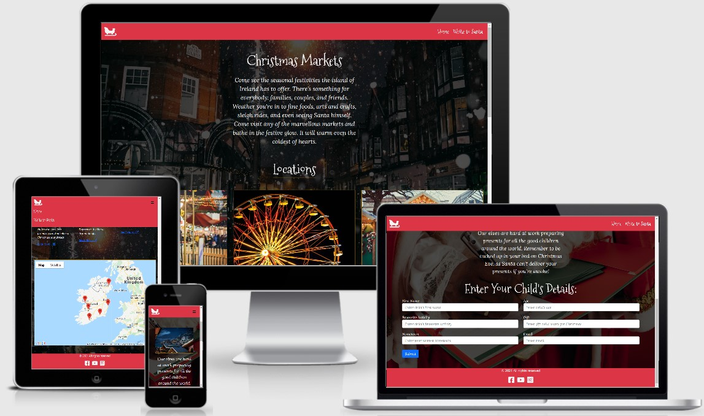
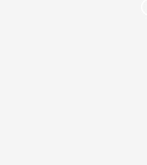

# MS2 - Nollaig

This is my website which will be used to display Christmas activites for people of all ages.
It should feature a home page with some general information on Christmas markets in Ireland, and a write to Santa section.
The primary goal is to enable people to discover interesting and fun ways to enter the festive season.

To do this the website will feature general information on various Christmas markets located in Ireland, and a form which can be submitted that generates a personalised email from Santa in return.
I will use festive imagery and coloring to compliment this theme.
They're will be some snapshots included with the snippets on the Christmas markets along with a link to each ones website.
The background images should be relevant to the purpose of the page they're on.

[Live Website](https://m-e-c-20.github.io/MS2/)

## UX

### User Stories

- As a new user, I would like to find out about Christmas events which I can attend happening in Ireland.
- As a new user, I would like to find out where these events are happening.
- As a new user, I would like to be able to redirect to these event's official webpage for more information if I choose to.
- As a new user, I would like to use this website as a way to get me and my family in a festive mood in the lead up to Christmas.
- As a new user, I would like to be able to send a letter to Santa for my children, and get a personalised response in return.
- As the owner, I want my site to be easily navigable for users.
- As the owner, I wish to provide a festive setting for people to build excitement in the run up to Christmas.
- As the owner, I want to inform visitors of Christmas events happening in Ireland.
- As the owner, I want my website to be friendly to users of all ages.

### Strategy

The main goal of this website is to be an avenue for users of all ages to enable themselves to enjoy the festivities at Christmas time.
This will be done by allowing users to discover where Christmas events happening around Ireland. The users will also be able to 
discover more about these events from using external links navigating them to more specific content about these events. 
Users with children will be able to send a message to Santa, and receive an email directed to their children. This website should be easy to navigate and
be clear in it's purpose to any user.

### Scope

I want to use a clear and warm design to fit in with the Christmas theme of this website.
It is important to use a clear, intuitive interface to avoid delivering a poor user experience.

### Structure

In each section I want to keep a common navbar and a common footer. In the header there will be a navbar with site links and a logo.
In the footer section there will be copyright mark and social media icons which will act as buttons linking to their respective sites.

### Skeleton

- [Home Page Wireframes](https://github.com/M-E-C-20/MS2/blob/master/wireframes/MS2-home.pdf)
- [Write to Santa Page Wireframes](https://github.com/M-E-C-20/MS2/blob/master/wireframes/MS2-santa.pdf)

### Surface

#### Colours

For the navbar and footer, I decided to use the Bootstrap bg-danger color class (#DC3545). 
I used this as red is a color highly associated with Christmas, and I found this particular shade suitable because it has a soft and warm tone.
For the text I used a shade an off white color called whitesmoke (#F5F5F5). The slightly greyer shading lends to a softer contrast and less strain while reading.
It has a very similar color as snow, which adds to the theme of the website.
Finally, I used darkgoldenrod (#B8860B) color as the border for the images, and underlining the subheadings.
Gold is another color associated with Christmas, particularly in decoration, so I thought it suitable for decorating text, and provided a nice contrast with the shaded background.

  

#### Fonts

For headings, I have used the "Mountains of Christmas" font. I think it suits a Christmas themed website and is a very festive themed font.
For any other blocks of text, I have used the "Lora" font, which I also think carries a festive spirit, but is more practical for blocks of more descriptive text.

#### Icons

I used the hamburger icon for my menu because it is widely recognised and used.
I used the external link icon to indicate the presence of a clickable link in the information section of each market as it is an easily recognisable icon.
In the footer I used standard icons for copyright, Facebook, Youtube and Instagram. All icons used in this project were sourced from Font Awesome.

## Features

### Existing Features

- Navbar - allows the user to navigate the site using the listed buttons. The company name/logo also acts as a home button.
- Home - There is a short summary with preview images of Christmas Markets located around Ireland. Included will also be links to the official web pages of these events.
- Embedded Map - On the bottom of the home page, the embedded map contains clickable markers which zoom in and tell you which market it represents when clicked.
- Write to Santa - On this page you can fill out your child's details and receive a personalised reply via email.
- Footer - The footer contains social media links which should open in a new browser window.

### Features to be Implemented
- Quiz - I would like to add a short, and simple Christmas themed quiz in the future.
    - [Quiz Page Wireframes](https://github.com/M-E-C-20/MS2/blob/master/wireframes/MS2-quiz.pdf)
- I would also like to add a page which includes Christmas activities, such as some arts and crafts with explanations on how to make your own.
    - [Activities Page Wireframes](https://github.com/M-E-C-20/MS2/blob/master/wireframes/MS2-activities.pdf)
- I would like to improve the fuctionality of the website by joining the information cards to the Google Maps API to create a more seamless and convenient transition between sections.

## Technologies Used

- [Balsamiq Wireframes](https://balsamiq.com/wireframes/?gclid=Cj0KCQiAhs79BRD0ARIsAC6XpaVYvwCWIORZNFLa4ZbfPQf8gAchZhdlP10mZeYDFooTFk1sW1Pua4caAgsmEALw_wcB)
  - The project uses Balsamiq Wireframes for desktop to generate wireframes for the website.
- [Gitpod](https://www.gitpod.io/)
  - I used Gitpod to write my code for this project.
- [Git](https://git-scm.com/)
  - The project uses Git to update records to any changes to files.
- [GitHub](https://github.com/)
  - The project uses Github as a hosting service for version control.
- [GitHub Pages](https://pages.github.com/)
  - The project uses GitHub Pages to host the website.
- [Bootstrap](https://getbootstrap.com/)
  - The project uses Bootstrap heavily to help build the site.
- [Google Fonts](https://fonts.google.com/)
  - The project uses Google Fonts to style the fonts on the website.
- [Font Awesome](https://fontawesome.com/)
  - The project uses Font Awesome to add to my navigation buttons.
- [Pexels](https://www.pexels.com/)
  - Many of the photos used in this project came from this website.
- [Canva](https://www.canva.com/en_gb/)
  - I used Canva to design the logo for this website.
- [CompressJPEG](https://compressjpeg.com/)
  - The project uses CompressJPEG to resize the images used on the site.
- [Chrome DevTools](https://developers.google.com/web/tools/chrome-devtools)
  - The project uses Chrome DevTools to analyse performance, accessibility, and best practices.
- [EmailJS](https://www.emailjs.com/)
    - The project uses EmailJS API to create an automatic response email which is updated based on your responses.
- [Google Maps Platform](https://developers.google.com/maps/documentation/?_ga=2.183907430.1952510718.1611081123-1204686115.1606483340)
    - The project uses Google Maps Platform API to embed a map with markers to indicate the geographic position of Christmas markets.
- [CSS Lint](http://csslint.net/)
  - The project uses CSS Lint as an extra testing step after initially manual checks.
- [W3C CSS Validator](https://jigsaw.w3.org/css-validator/#validate_by_input)
  - The project uses this to test CSS by direct input.
- [W3C Markup Validation Service](https://validator.w3.org/#validate_by_input)
  - The project uses this to pinpoint errors in HTML markup.
- [JSHint](https://jshint.com/)
    - The project uses JSHint to detect errors and potential problems in the JavaScript code.

## Testing

Testing can be found at [TESTING](TESTING.md)
   

4. ### [Chrome DevTools:](https://developers.google.com/web/tools/chrome-devtools)

   

     [Link to pdf of results](https://github.com/M-E-C-20/)

5. ### [Color Contrast Accessibility Validator](https://color.a11y.com/?wc3)

   

6. ### [Web Accessibility](https://www.webaccessibility.com/results/?url=https%3A%2F%2Fm-e-c-20.github.io%2FPB-Motors%2Fgallery.html)

   

7. ### Website Functionality

   

   1. #### Home

   

   Home page screenshots:

   - [desktop](https://github.com/M-E-C-20/)
   - [mobile](https://github.com/M-E-C-20/)

   2. #### Quiz

   

   Quiz page screenshots:

   - [desktop](https://github.com/M-E-C-20/)
   - [mobile](https://github.com/M-E-C-20/)

   3. #### Activities

   

   Activities page screenshots:

   - [desktop](https://github.com/M-E-C-20/)
   - [mobile](https://github.com/M-E-C-20/)

   4. #### Letter to Santa

   

   Letter to Santa page screenshots:

   - [desktop](https://github.com/M-E-C-20/)
   - [mobile](https://github.com/M-E-C-20/)

## Deployment

This project was developed in Gitpod, controlled using Git, and hosted using GitHub. The live webpage is hosted by GitHub Pages.
To deploy MS2 using GitHub pages the following steps were taken:

1. Open **GitHub** in the browser.
2. Sign in using my username and password.
3. Click on **my repositories**.
4. Select **MS2**.
5. Click on **settings**.
6. Scroll down to **GitHub Pages**.
7. Select **Master Branch** from the Source dropdown menu.
8. Save my selection.
9. MS2 is now live on GitHub Pages.

To run MS2 locally the following steps must be taken:

1. Navigate back to **M-E-C-20/MS2**.
2. Click on the **Code** button.
3. Make sure **HTTPS** is selected.
4. Copy the URL supplied.
5. Open up the terminal in your IDE.
6. Input git clone followed by the URL you copied into the terminal.

\$ git clone https://github.com/M-E-C-20/MS2.git

## Credits

### Media

### Acknowledgements

- I used the [Code Institute](https://github.com/Code-Institute-Solutions/readme-template) README template as a base for my own.
