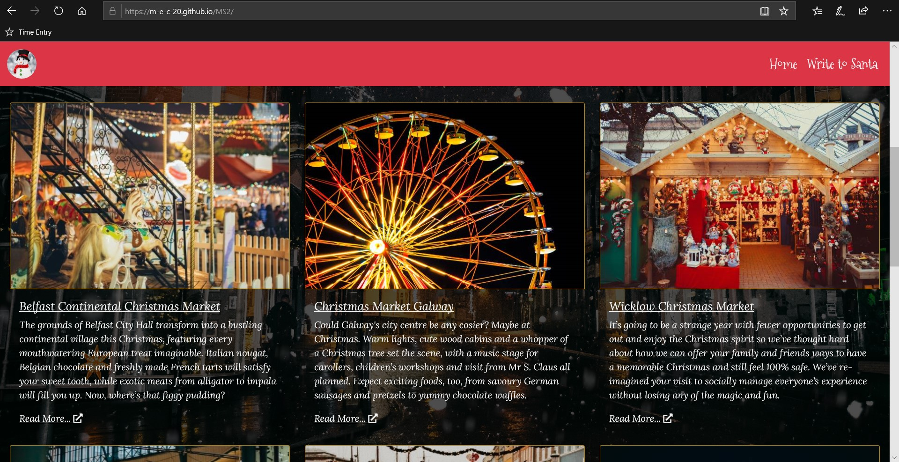
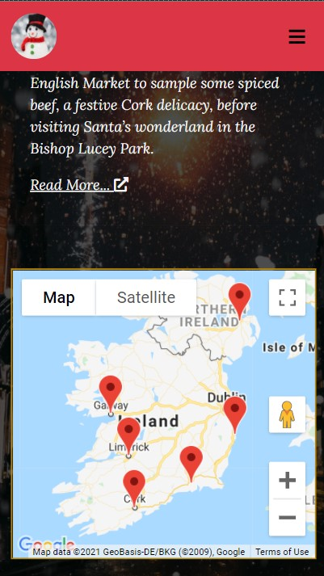

# MS2 - Testing Documentation

The main README documentation can be found at [README.md](README.md)

[Live Website](https://m-e-c-20.github.io/MS2/)

## Supported Screens and Browsers

 Unless otherwise stated, all desktop test cases have been carried out across Google Chrome, Firefox, and Microsoft Edge.
All mobile and tablet platform based testing has been performed using Chrome Devtools virtual devices.
The devices I have chosen and their dimensions are:
 1. Galaxy Fold - 280 x 653
 2. Moto G4 - 360 x 640
 3. iPad - 768 x 1024

## Test Cases

### As a new user, I would like to find out about Christmas events which I can attend happening in Ireland.
- On arrival to the home screen, headings are displayed correctly and not hidden or obsured in any way.
The text is easily legible and easy to understand. Images are displaying correctly, and there is no overspill of content.

 

### As a new user, I would like to find out where these events are happening.
- When the user navigates down the page, they see a heading saying "Locations", and beneath they can find some images of Christmas markets with some descriptive text underneath.
Each subsection of content describes where the event is happening.
Below these descriptions, the user can find a map with markers locating each of these markets.

 

### As a new user, I would like to be able to redirect to these event's official webpage for more information if I choose to.
- There are two ways for a user to do this.
Firstly they can click on the "Read more..." link underneath each descriptive text, which is indicated by an external link icon next to them.
Secondly, they may click on the map markers, which will display an info window containing a link to the official channels of each market.

 

### As a new user, I would like to use this website as a way to get me and my family in a festive mood in the lead up to Christmas.
- The user can use the information garnered on the home page to plan an excursion for their own pleasure.
If the user has children, they can navigate to the "Write to Santa" page.
There they will find a form, in which they can input their child's details to receive a personalised message from Santa Claus.

 

### As a new user, I would like to be able to send a letter to Santa for my children, and get a personalised response in return.
- After navigating to the "Write to Santa" page, the user can see can see a heading with some text underneath which encourages them to scroll down to receive a letter from Santa.
The text is easily legible and easy to understand. 
Images are displaying correctly, and there is no overspill of content.
At the bottom of the page they can find a form, which asks for :

    1. The child's name - required field
    2. The child's age - required field, the user is unable to type letters in the input field, only numbers
    3. The child's favourite activity - required field
    4. A gift the child wants for Christmas - required field
    5. An email address - required field, this should also require that an @ symbol should be used

If any fields are left blank or are incorrectly input, then the form will not submit.
Upon inputting each field correctly, a popup displays informing the user that they were successful, and a response is being generated.

 

### As the owner, I want my site to be easily navigable for users.
- When navigating the site, a user can move between pages without the use of the browser forward and back buttons.
The navbar scrolls with the page, so that the navbar links are always available, and the logo on the navbar also acts as a navigation button to the home page.
All content is clearly visible and scales correctly to screen size without obscuring any content or overspill.

 

### As the owner, I wish to provide a festive setting for people to build excitement in the run up to Christmas.
- The background image of each page has a festive theme and displays correctly.
On both pages, the Christmas market images display and reposition correctly depending on device.
All colour schemes remain consistant and there is no accidental deviations.

 

### As the owner, I want to inform visitors of Christmas events happening in Ireland.
- On navigation to the home screen, headings are clear and positioned correctly.
More informative content is located below the locations heading.
Images are aligned correctly with one another and related text is aligned properly with its related image.
Below the descriptive content a user can discover the locations of these events using the embedded map.
There are map markers on each of the Christmas market locations which zoom in and display an info window when clicked on.
There are links to official Christmas market websites located at the bottom of each descriptive block of text and within an info window on the map markers.

 

### As the owner, I want my website to be friendly to users of all ages.
- A user may use the home page to enquire in to any activities of interest to them, and use the exernal links to look in to it in greater detail.
A user may also use the form to receive an email from Santa for their children.
If any fields are left blank or are incorrectly input, then the form will not submit.
Upon inputting each field correctly, a popup displays informing the user that they were successful, and a response is being generated.

 

## Code Validation

### [W3C CSS Validator](https://jigsaw.w3.org/css-validator/#validate_by_input)
Validated my CSS by direct input in to the CSS validator and no erors were found.

### [W3C Markup Validation Service](https://validator.w3.org/#validate_by_input)
- Validated index.html by direct input - one warning: 
   -  The type attribute is unnecessary for JavaScript resources.
Removed the type attribute from line 251 in index.html and re-ran the validator - no errors or warnings to show.
- Validated contact.html by direct input - one error:
    - The value of the for attribute of the label element must be the ID of a non-hidden form control. Changed for attribute to emailaddress and re-ran - no error.

### JSHint
Ran contact.js through JSHint, and found no major errors.

Ran maps.js through JSHint, and found no major errors.

### Chrome Devtools
- Home page:
    1. Desktop
        >  
    2. Mobile
        > 

- Write to Santa page:
    1. Desktop
        > 
    2. Mobile
        > 

## Fixed Bugs
- In the form in contact.html, the age input area was set to type="text", which meant that a user could input letters. 
This could create issues with the auto reply email, as it requires accurate and valid data to be convincing to the user.
    - Fix: Changed the type to number, which fixed the issue.
- In the form in contact.html, the age input area had no minimum value, which meant that negative age values could be selected.
    - Fix: Add min="0" to age input field.
- In contact.html, after submitting the form, the only confirmation that the form was sent was a browser alert.
    - Fix: Add a popup modal that appears when the form has been submitted successfully.
- In contact.html, after closing the modal popup, the form details remained in the input fields.
    - Fix: Add clear() function so that the form fields cleared after successful submission.
